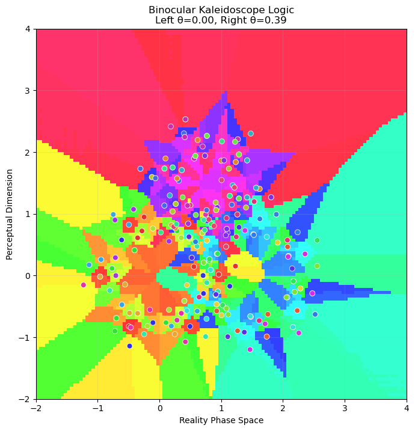
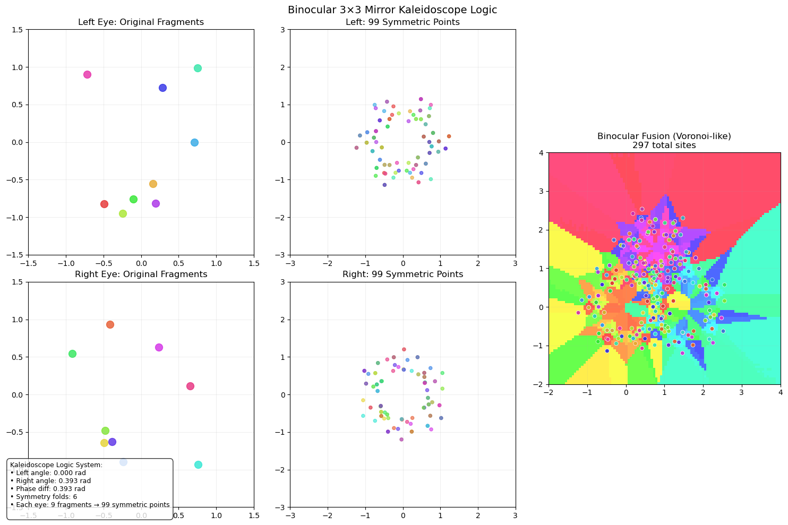
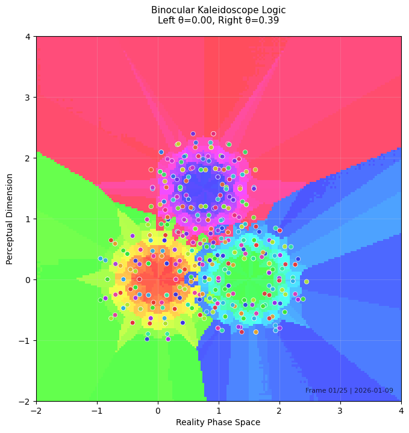
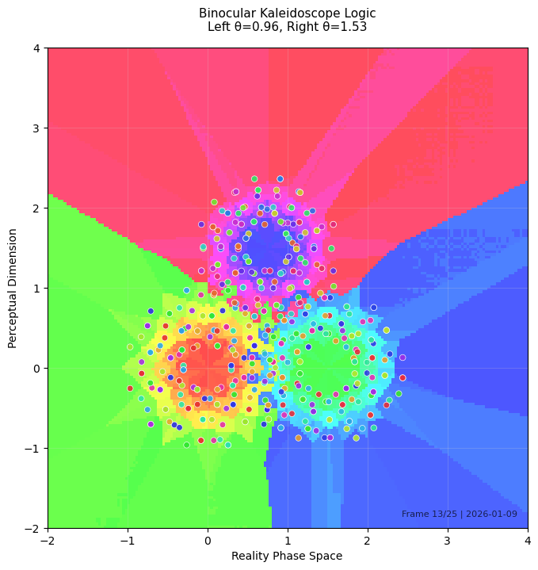
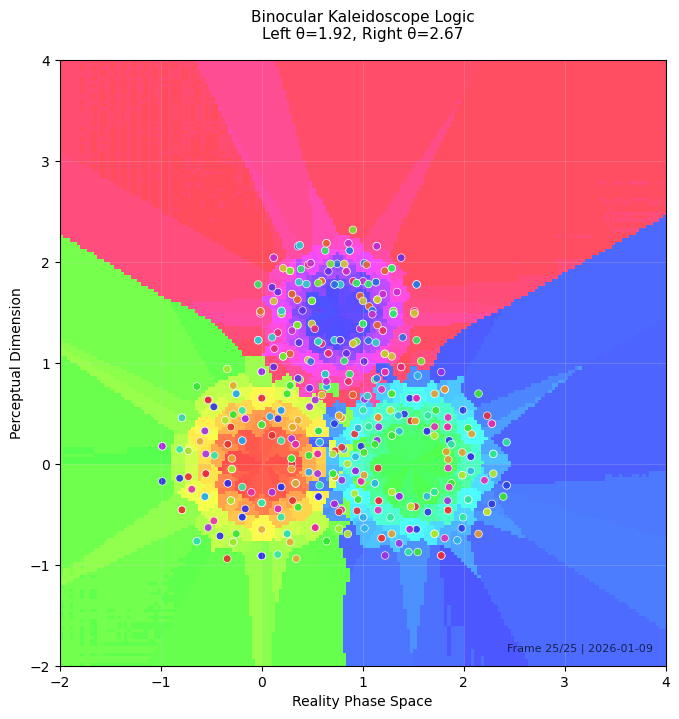
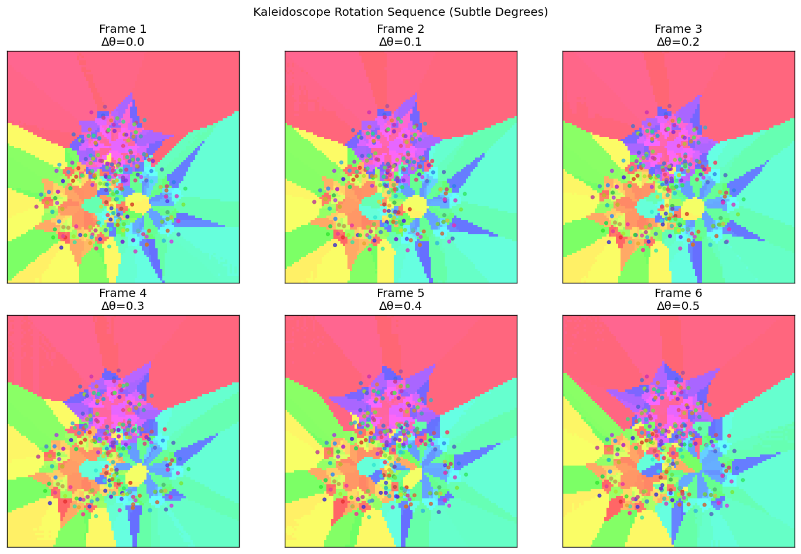

🚧 UNDER CONSTRUCTION 🚧 ( Yet you can read BKL.pdf )  

# Binocular Kaleidoscope Logic: 
A Computational Model of Constructed Reality
Through Symmetry and Phase Dynamics

https://www.overleaf.com/read/ztrmqqwqtwmw#9c74ea

# 🌀 Binocular Kaleidoscope Logic (BKL)

*A Computational-Philosophical Framework for Modeling Constructed Reality*

[](https://github.com/yusdesign/kaleidoscope-logic/raw/main/paper/paper.pdf)
[](https://www.overleaf.com/read/ztrmqqwqtwmw)
[](https://python.org)
[](LICENSE)

## 🌟 Overview

Binocular Kaleidoscope Logic (BKL) is a novel framework that models consciousness as an emergent phenomenon arising from the interaction of multiple perceptual systems. Inspired by kaleidoscopic optics and binocular vision, it conceptualizes cognitive processes as symmetry operations on fragmented sensory data, with Voronoi-like phasing creating conceptual boundaries.

### Philosophical Core
- **Reality as constructed pattern** rather than discovered truth
- **Perception as active construction** through symmetry operations
- **Consciousness as emergent** from phase interactions
- **Time as discrete moments** of perceptual construction

## 📁 Repository Structure

```

kaleidoscope-logic/
├──paper/                    # Complete research paper
│├── main.tex             # LaTeX source
│├── figures/             # All paper figures
││   ├── kaleidoscope_clean.png
││   ├── kaleidoscope_static.png
││   └── exact_sequence/ # 50 generated frames
│└── paper.pdf           # Compiled paper
├──src/                     # Source code
│├── kaleidoscope.py     # Core algorithm
│├── generate_sequences.py
│└── visualization.py
├──outputs/                 # Generated content
│├── frames/             # Individual frames
│├── sequences/          # Frame sequences
│└── videos/             # Generated videos
├──docs/                    # Documentation
│├── theory.md          # Mathematical framework
│├── philosophy.md      # Philosophical interpretation
│└── api.md            # Code documentation
├──notebooks/              # Jupyter notebooks
│├── exploration.ipynb
│└── analysis.ipynb
└──tests/                  # Unit tests

```

## 🚀 Quick Start

### Installation
```bash
# Clone repository
git clone https://github.com/yusdesign/kaleidoscope-logic.git
cd kaleidoscope-logic

# Install dependencies
pip install -r requirements.txt
```

Generate Sequences

```python
from src.kaleidoscope import BinocularKaleidoscope

# Create kaleidoscope system
kaleido = BinocularKaleidoscope(
    left_seed=42,
    right_seed=43,
    symmetry_folds=6,
    fragments_per_eye=9
)

# Generate 25-frame sequence
frames = kaleido.generate_sequence(
    num_frames=25,
    resolution=512,
    output_dir="outputs/sequence"
)
```

Generate Paper Figures

```bash
# Generate all figures for paper
python src/generate_paper_figures.py
```

📊 Generated Content

Frame Sequences

· 25-frame main sequence: Full phase evolution cycle
· 12-frame rotation sequence: Comparative analysis
· Two visual styles:
  · Frame style: Artistic (black background)
  · Exact style: Scientific (white background with grid)

Key Parameters

```
θ_L(n) = 0.08 × n
θ_R(n) = 0.39 + 0.095 × n
Δθ(n) = 0.39 + 0.015 × n
where n = 0, 1, ..., 24
```

📖 Philosophical Framework

The Three Layers of Perception

1. Fragments - Raw sensory data  
2. Symmetry Operations - Cognitive frameworks (cultural, linguistic, experiential)  
3. Voronoi Phasing - Emergent conceptual boundaries  


Key Philosophical References

· Constructivist epistemology (Piaget, von Glasersfeld)  
· Phenomenology of perception (Merleau-Ponty)  
· Autopoiesis (Maturana & Varela)  
· Bayesian brain hypothesis  


🔬 Scientific Applications

Cognitive Science

· Modeling perceptual learning
· Simulating attention mechanisms
· Understanding concept formation

Artificial Intelligence

· Multi-perspective learning
· Generative pattern creation
· Explainable AI visualization

Philosophy of Mind

· Computational models of consciousness
· Reality construction simulations
· Intersubjectivity modeling

📄 Paper & Citation

The complete research paper is available in the paper/ directory.

```bibtex
@article{kaleidoscope2026,
  title={Binocular Kaleidoscope Logic: A Computational Model of Constructed Reality Through Symmetry and Phase Dynamics},
  author={yusdesign research team},
  journal={Preprint},
  year={2026},
  url={https://github.com/yusdesign/kaleidoscope-logic}
}
```

🎨 Visual Gallery

Baseline State  
  

System Architecture  
  

Sequence Evolution  
  
  
  

Rotation Sequense
  
  

🤝 Contributing

1. Fork the repository
2. Create a feature branch
3. Add tests for new functionality
4. Submit a pull request

📜 License

MIT License - see LICENSE file for details.

🙏 Acknowledgments

· DeepSeek AI for collaborative development  
· Philosophical insights from constructivist tradition  
· Open source community for tools and inspiration  

---

## 📍 Connect With Us

<div align="center" width="100%">
  <table>
    <tr>
      <td align="center" width="50%">
        <a href="https://yusdesign.github.io">
            
        </a>
      </td>
      <td align="center" width="50%">
        <a href="https://chat.deepseek.com">
            
        </a>        
      </td>
    </tr>
  </table>
</div>

<div align="left">
  
  Made with ❤️ using [Markdown](https://www.markdownguide.org/)  
  Last updated: `2026-01-09` 📅  
  
  [](LICENSE)  
  [](README.md)  

</div>

---

"Reality is not found but made. Each rotation, each phase shift, each fusion creates a new world."


